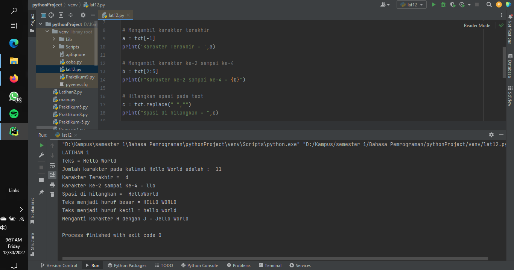
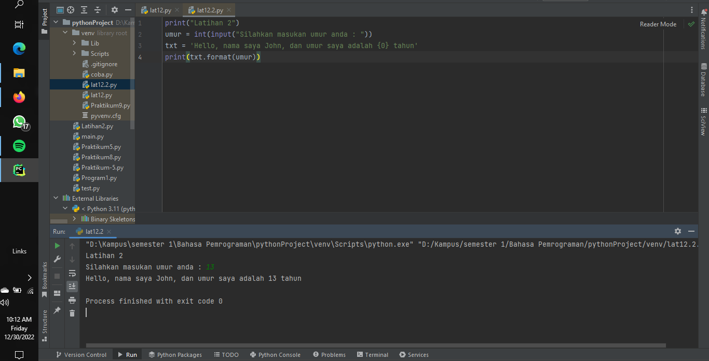

# Praktikum12

## Tugas pertemuan ke 14 Bahasa Pemrograman
## Nama : Prayudha Ragil MUsthofa
## NIM : 312210726
## Kelas : TI.22.C.9


# Latihan 1

**txt = 'Hello World'**
 - Hitung jumlah karakternya
 - Ambil karakter terakhir
 - Ambil karakter index ke-2 sampai index ke-4 (llo)
 - Hilangkan spasi pada text tersebut (HelloWorld)
 - Ubah text menjadi huruf besar
 - Ubah text menjadi huruf kecil
 - Ganti karakter H dengan karakter J

```bash
txt = 'Hello World'
print("LATIHAN 1")
print(f"Teks = {txt}")
# Menghitung jumlah karakter
print("Jumlah karakter pada kalimat "+txt+" adalah : ",len(txt))
# Mengambil karakter terakhir
a = txt[-1]
print('Karakter Terakhir = ',a)
# Mengambil karakter ke-2 sampai ke-4
b = txt[2:5]
print(f"Karakter ke-2 sampai ke-4 = {b}")
# Hilangkan spasi pada text
c = txt.replace(" ","")
print("Spasi di hilangkan = ",c)
# Ubah teks menjadi huruf besar
d = txt.upper()
print(f"Teks menjadi huruf besar = {d}")
# Ubah teks menjadi huruf kecil
e = txt.lower()
print(f"Teks menjadi huruf kecil = {e}")
# Ganti karakter H dengan karakter J
f = txt.replace("H","J")
print(f"Menganti karakter H dengan J = {f}")
```



# Latihan 2

```bash
print("Latihan 2")
umur = int(input("Silahkan masukan umur anda : "))
txt = 'Hello, nama saya John, dan umur saya adalah {0} tahun'
print(txt.format(umur))
```


# Sekian dan Terimakasih